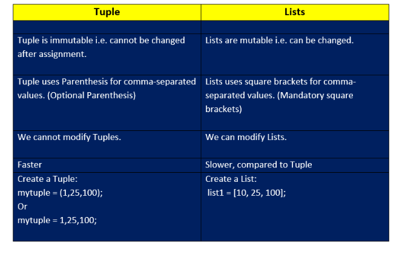
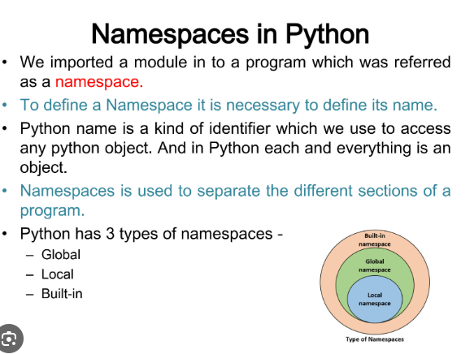
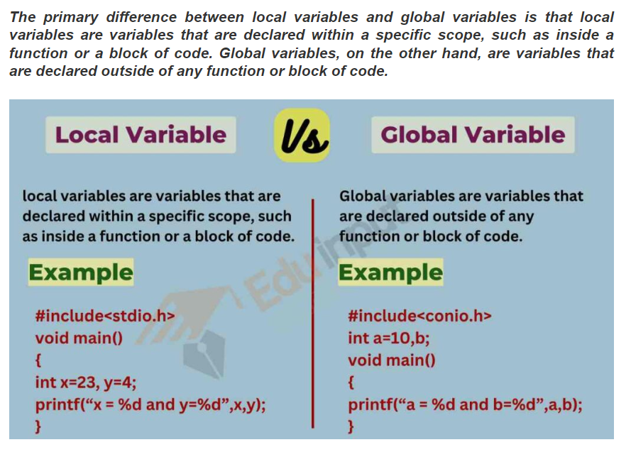
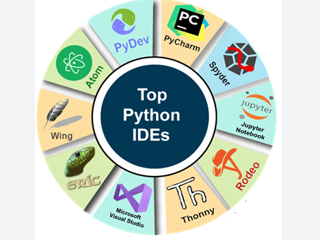
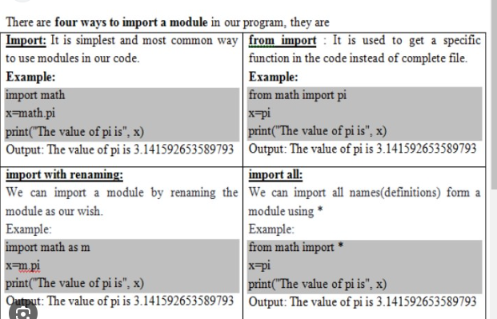
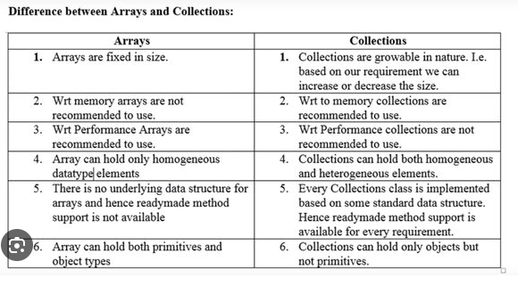
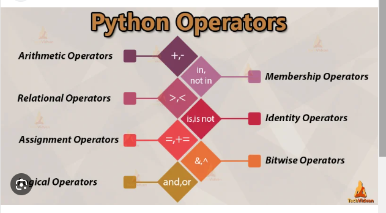

# 🔎Python fact finding exercise

### 1. Define a listand tuple in Python. Provide some examples

### 2..What is a namespacein Python?

### 3. What is the difference between a Local Variable and Global variable?

### 4. What is an IDE? Mention some common IDEs that could be used with Python

### 5. What are modulesin Python? Provide some examples.

### 6. What is the difference between an arrayand a list?

### 7. What are operators? Provide some examples
An operator is a symbol that will perform mathematical operations on variables or on values. Operators operate on operands (values) and return a result.

